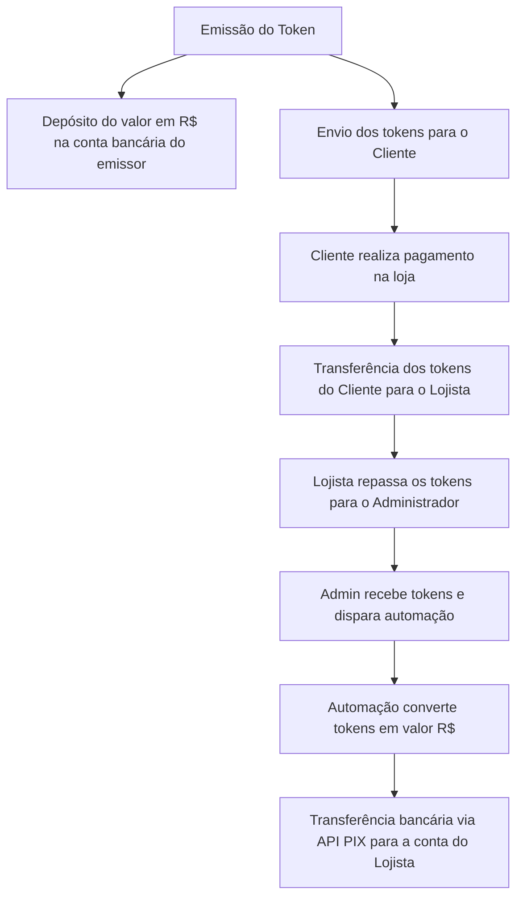
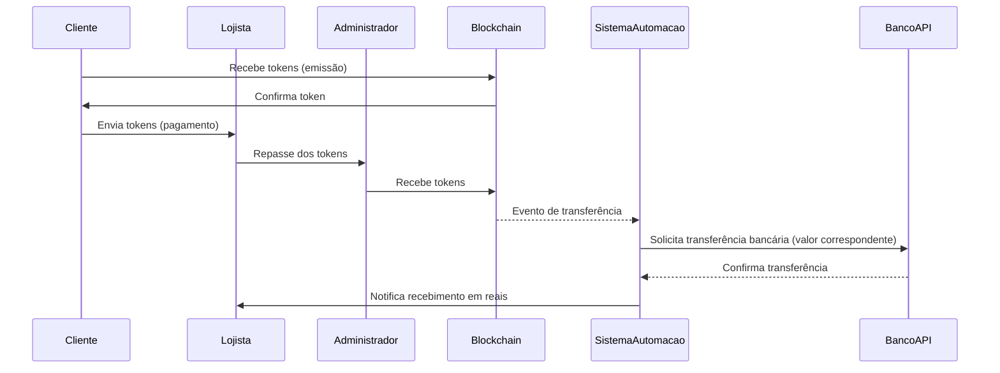

# Token Flow

Documentação do Processo de Emissão, Transferência e Conversão de Tokens

1. Visão Geral do Projeto

O sistema envolve a criação de um token que representa um valor em reais (R$1 por token). Ao ser emitido, o valor correspondente em reais é depositado em uma conta bancária. Em seguida, os tokens são enviados para o cliente. Nas transações comerciais, o fluxo ocorre da seguinte forma:

Cliente → Lojista: O cliente transfere tokens para o lojista ao efetuar uma compra.

Lojista → Administrador: O lojista repassa os tokens ao administrador.

Admin → Lojista: Ao receber os tokens, o administrador dispara uma automação que converte os tokens (com valor correspondente em reais) em uma transferência bancária para a conta do lojista.


Essa abordagem garante que, para cada token movimentado, haja uma contraparte financeira real (em reais) que espelha a movimentação dos tokens.


---

2. Fluxo de Processo

Etapas Detalhadas:

1. Emissão do Token e Depósito Bancário:

Token Emitido: Quando o token é criado, o sistema realiza duas ações simultâneas:

Depósito do valor correspondente (R$1 por token) em uma conta bancária.

Transferência dos tokens para a carteira do cliente.


2. Transferência do Cliente para o Lojista:

O cliente utiliza sua carteira digital para enviar tokens ao lojista como forma de pagamento.

O valor transferido em tokens corresponde ao valor da compra.


3. Repasse do Lojista para o Administrador:

Após receber os tokens do cliente, o lojista repassa os tokens para o administrador.

Essa etapa pode servir para fins de controle, liquidação ou gerenciamento centralizado das transações.


4. Automação de Transferência Bancária:

Assim que o administrador recebe os tokens, o sistema monitora essa carteira.

Uma automação é disparada para verificar o número de tokens e calcular o valor em reais correspondente.

O sistema então utiliza uma API (por exemplo, uma API PIX) para efetuar uma transferência bancária automática para a conta do lojista.

Essa operação garante que o lojista receba, em reais, o valor correspondente aos tokens repassados.


---

3. Diagrama de Fluxo

O diagrama abaixo ilustra o fluxo completo do processo:



Legenda:

A: Criação e emissão do token.

B: Depósito do valor correspondente (R$1 por token) na conta do emissor.

C: Token enviado para o cliente.

D/E: Transação de pagamento, onde os tokens são usados para comprar produtos/serviços.

F: Lojista encaminha os tokens para o administrador.

G/H/I: Automação que converte os tokens em valor monetário e efetua a transferência bancária para o lojista.


---

4. Componentes Técnicos do Sistema

4.1. Backend e Monitoramento dos Eventos na Blockchain

Monitoramento de Eventos: Utilização de bibliotecas (ex.: Web3.py para Ethereum ou outras dependendo da blockchain) para detectar eventos de transferência do token.

Exemplo de Código (simplificado):

```py
from web3 import Web3

w3 = Web3(Web3.HTTPProvider("https://seu_provedor_rpc"))
contrato = w3.eth.contract(address='0xSeuContrato', abi=seu_abi)

def tratar_evento_transfer(event):
    remetente = event['args']['from']
    destinatario = event['args']['to']
    quantidade = event['args']['value']
    # Processar o evento e identificar se é transferência para o administrador
    if destinatario == "endereço_administrador":
        disparar_automacao(quantidade)

evento_transfer = contrato.events.Transfer.createFilter(fromBlock='latest')
while True:
    for evento in evento_transfer.get_new_entries():
        tratar_evento_transfer(evento)
```

4.2. Mapeamento de Carteiras e Contas Bancárias

Banco de Dados: Armazenar o mapeamento entre as carteiras de tokens e as chaves/contas bancárias espelho.


4.3. Automação da Transferência Bancária

API PIX: Utilização de APIs de instituições financeiras para a execução de transferências.

Fluxo da Automação:

1. Recebimento dos tokens na carteira do administrador.


2. Conversão da quantidade de tokens em valor em reais.


3. Requisição à API PIX para transferência bancária para a conta do lojista.

Exemplo de Código (simplificado):

```py
import requests

def obter_token_pix():
    # Implementar autenticação OAuth2 ou outro método de autenticação da API
    return "seu_access_token"

def transferencia_pix(chave_destino, valor):
    token = obter_token_pix()
    headers = {
        "Authorization": f"Bearer {token}",
        "Content-Type": "application/json"
    }
    payload = {
        "calendario": {"expiracao": 3600},
        "valor": {"original": f"{valor:.2f}"},
        "chave": chave_destino,
        "solicitacaoPagador": "Pagamento automático via token"
    }
    url = "https://api.seubanco.com/pix/transactions"
    resposta = requests.post(url, json=payload, headers=headers)
    return resposta.json()

def disparar_automacao(quantidade_tokens):
    valor_em_reais = quantidade_tokens  # 1 token = R$1
    # Buscar chave PIX do lojista correspondente (pode ser uma consulta no banco de dados)
    chave_destino = "chave_pix_lojista@example.com"
    resultado = transferencia_pix(chave_destino, valor_em_reais)
    print("Resultado da transferência:", resultado)
```


---

5. Diagrama de Sequência (Interação dos Componentes)

Para visualizar a interação entre as partes do sistema, veja o diagrama de sequência abaixo:



---

6. Considerações Finais

Segurança e Validação:

Implementar verificações para garantir que os eventos na blockchain sejam legítimos.

Validar o mapeamento entre carteiras e contas bancárias.

Usar práticas de segurança na comunicação com a API PIX (autenticação, criptografia, etc.).


Auditoria e Logs:

Registrar todos os eventos e transações para auditoria e resolução de possíveis divergências.

Monitorar falhas e implementar mecanismos de retry (nova tentativa) em caso de falhas na comunicação com a API bancária.


Escalabilidade:

Planejar o sistema para lidar com picos de transações, especialmente em períodos de alta demanda.


Esta documentação oferece uma visão detalhada e didática de como o seu sistema integra a emissão de tokens, transações na blockchain e automação de transferências bancárias, garantindo que cada movimento de token seja espelhado com a movimentação financeira correspondente
